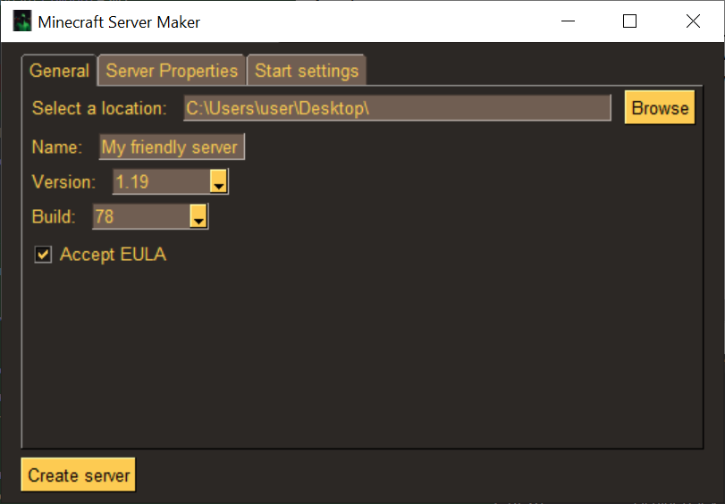
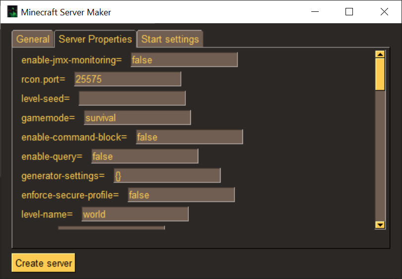
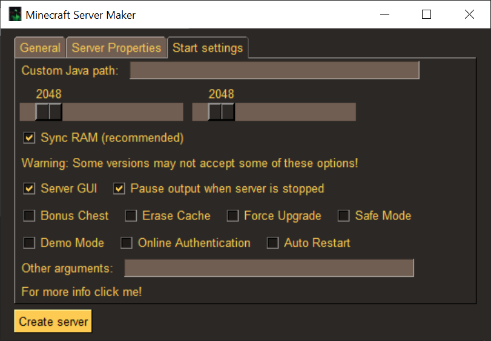

# Minecraft Server Maker

 Make your own Minecraft server easily!

## Description

This is a simple Minecraft server maker. It is a simple tool that allows you to create a Minecraft server with a few simple steps.

It creates a folder with the name provided at the choosen location (default: desktop). It downloads the choosen version of papermc, it then creates a server.properties file with the default values if you didn't change any, and then a start.bat file corresponding to the settings selected that you will use to start your server.

## Usage

1. Find a location where you want to save your server.
2. Enter the name for the folder of your server.
3. Set a minecraft version and a papermc build.
4. Optional: change server properties and start file.
5. Press "Create server" and wait.

## Layout

## Changelog

[changelog.txt](changelog.txt)
